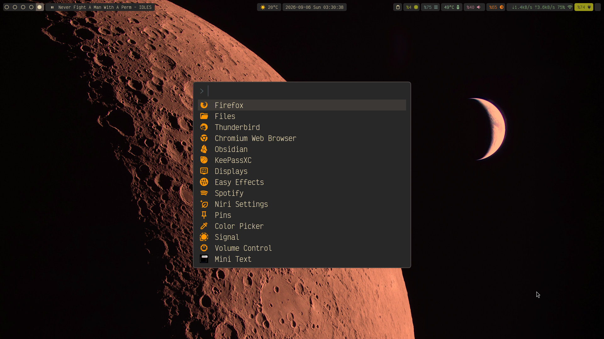

# dotfiles

> miv403's configuration files

```bash
systemctl --user add-wants niri.service mako.service
```

## current usage



### desktop

- niri
- waybar
  - calendar at-a-glance
  - clipboard
  - detailed temperature and fan info
  - weather with wttr.in
- mako
  - volume/brightness indicator (volumeosd/brightnessosd)
- fuzzel
  - org capture (fuzzel-capture)
  - clipboard (cliphist)
- niri-ocr: uses tesseract for turkish&english image-to-text extraction
- [selectra](https://github.com/miv403/selectra): tureng dictionary lookup with notification
- [rofi-tdk.sh](https://github.com/metwse/rofi-tdk.sh): tdk sözlük for rofi
- [project manager](https://github.com/miv403/project-manager): project switcher/manager with fuzzel.

### terminal

- alacritty
- tmux
  - scratchpad
- nvim

### calendar/agenda

- doom: org agenda
- khal: calendar
- vdirsyncer: google calendar sync
